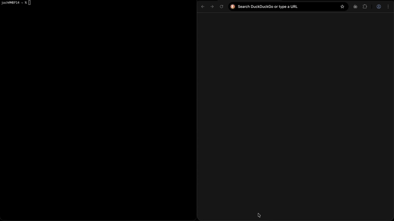

# OpenCode Browser MCP Plugin

An OpenCode plugin that integrates [Browser MCP](https://browsermcp.io) to enable browser automation capabilities within OpenCode. This plugin allows the AI to control a browser, navigate websites, fill forms, click elements, and perform other browser automation tasks.

## Demo



## Features

- Full browser automation support through Browser MCP
- **Automatic reconnection** when browser extension is disabled/enabled
- **Exponential backoff retry logic** for handling connection failures
- **Connection health monitoring** to detect and recover from disconnections
- Automatic detection of browser-related tasks
- Context preservation for browser state across session compactions
- Logging and monitoring of browser automation activities
- Seamless integration with OpenCode's existing tools

## Prerequisites

Before using this plugin, you need:

1. **Node.js** installed on your system
2. **OpenCode** installed and configured
3. **Browser MCP extension** installed in your browser (Chrome/Edge)

## Installation

### Step 1: Install Browser MCP Extension

1. Visit [https://browsermcp.io/install](https://browsermcp.io/install)
2. Install the Browser MCP extension for your browser (Chrome or Edge)
3. Follow the extension setup instructions

### Step 2: Configure OpenCode

Create or update your `opencode.json` configuration file. You can create this file in one of two locations:

- **Global configuration** (applies to all projects): `~/.config/opencode/opencode.json`
- **Project-specific configuration** (applies to current project only): `./opencode.json` (in your project root)

Learn more about OpenCode configuration at [https://opencode.ai/docs/config](https://opencode.ai/docs/config)

Add this configuration to your `opencode.json`:

```json
{
  "$schema": "https://opencode.ai/config.json",
  "plugin": ["opencode-browser"],
  "mcp": {
    "browsermcp": {
      "type": "local",
      "command": ["npx", "-y", "@browsermcp/mcp@latest"],
      "enabled": true
    }
  }
}
```

This configuration does two things:
1. **Installs the plugin** - OpenCode automatically downloads `opencode-browser` from npm
2. **Configures Browser MCP** - Sets up the MCP server that actually controls the browser

That's it! No manual file copying required. OpenCode handles everything automatically.

#### Alternative: Install Locally (for development/testing)

If you want to modify the plugin or test changes:

**For global installation:**
```bash
mkdir -p ~/.config/opencode/plugin
cp index.ts ~/.config/opencode/plugin/browser-mcp.ts
```

**For project-specific installation:**
```bash
mkdir -p .opencode/plugin
cp index.ts .opencode/plugin/browser-mcp.ts
```

The plugin will be automatically loaded on OpenCode startup.

## Configuration

### Basic Configuration

The minimal configuration requires only the MCP server setup:

```json
{
  "$schema": "https://opencode.ai/config.json",
  "mcp": {
    "browsermcp": {
      "type": "local",
      "command": ["npx", "-y", "@browsermcp/mcp@latest"],
      "enabled": true
    }
  }
}
```

### Advanced Configuration

For more control, you can disable Browser MCP tools globally and enable them per agent:

```json
{
  "$schema": "https://opencode.ai/config.json",
  "mcp": {
    "browsermcp": {
      "type": "local",
      "command": ["npx", "-y", "@browsermcp/mcp@latest"],
      "enabled": true
    }
  },
  "tools": {
    "browsermcp_*": false
  },
  "agent": {
    "browser-agent": {
      "tools": {
        "browsermcp_*": true
      }
    }
  }
}
```

### Reconnection Configuration

The plugin uses these default reconnection settings:

- **Maximum retries**: 5 attempts
- **Initial delay**: 1 second
- **Maximum delay**: 30 seconds
- **Backoff multiplier**: 2x (exponential)

**Retry sequence**: 1s → 2s → 4s → 8s → 16s

These settings are optimized for most use cases, balancing quick recovery with avoiding excessive retry attempts. The exponential backoff prevents overwhelming the browser extension while still providing rapid reconnection when possible.

### Environment Variables

If you need to pass environment variables to the Browser MCP server:

```json
{
  "$schema": "https://opencode.ai/config.json",
  "mcp": {
    "browsermcp": {
      "type": "local",
      "command": ["npx", "-y", "@browsermcp/mcp@latest"],
      "enabled": true,
      "environment": {
        "BROWSER_MCP_DEBUG": "true"
      }
    }
  }
}
```

## Usage

Once installed and configured, you can use browser automation in your OpenCode prompts:

### Basic Browser Navigation

```
Navigate to https://github.com and search for "opencode"
```

### Form Filling

```
Go to the contact form at https://example.com/contact and fill in:
- Name: John Doe
- Email: john@example.com
- Message: Hello from OpenCode!
Then submit the form.
```

### Web Scraping

```
Visit https://news.ycombinator.com and get the titles of the top 5 stories
```

### Complex Automation

```
Go to https://example.com/login, log in with the test credentials,
navigate to the dashboard, and screenshot the main metrics panel
```

### Prompt Tips

For best results when using browser automation:

1. **Be specific** about URLs and actions
2. **Use step-by-step instructions** for complex workflows
3. **Specify selectors** when needed (CSS selectors, text content, etc.)
4. **Ask for verification** when critical (screenshots, text content)

You can also add browser automation guidelines to your `AGENTS.md` file:

```markdown
## Browser Automation

When performing browser automation tasks:
- Always confirm the page has loaded before interacting
- Use descriptive selectors (prefer text content over CSS selectors)
- Take screenshots when verification is needed
- Handle errors gracefully (page not found, element not visible, etc.)
- Close tabs when the task is complete
```

## Plugin Features

### Automatic Reconnection

The plugin automatically handles connection issues with the Browser MCP extension:

- **Automatic retry**: If the browser extension is disabled or disconnected, the plugin will automatically attempt to reconnect
- **Exponential backoff**: Retries use exponential backoff (1s, 2s, 4s, 8s, 16s) up to 30 seconds maximum
- **Smart detection**: Automatically detects connection errors and triggers reconnection
- **User notifications**: Keeps you informed about connection status and retry attempts
- **No restart required**: In most cases, you can disable/enable the Chrome extension without restarting OpenCode

**Example scenario:**
1. You're using browser automation in OpenCode
2. You disable the Browser MCP Chrome extension
3. Next browser command fails, plugin detects disconnection
4. You re-enable the Chrome extension
5. Plugin automatically reconnects on next attempt
6. Browser automation continues working

### Connection Health Monitoring

The plugin continuously monitors the health of the Browser MCP connection:

- Tracks connection state throughout your session
- Detects various types of connection errors (timeouts, network issues, etc.)
- Provides clear error messages when connection cannot be established
- Resets retry counter on successful reconnection

### Automatic Browser Tool Detection

The plugin automatically detects when Browser MCP tools are being used and logs the activity.

### Session Context Preservation

During session compaction, the plugin preserves browser automation context, ensuring the AI remembers:
- Browser interactions that occurred
- Current browser state considerations
- Need to verify page state before assumptions

### Tool Execution Hooks

The plugin hooks into tool execution to:
- Log browser automation activities
- Monitor tool arguments and results
- Enable custom post-processing of browser actions

## Troubleshooting

### Browser MCP Connection Lost

If you see connection errors:

1. **Check extension status**: Verify the Browser MCP extension is enabled in Chrome
2. **Wait for automatic reconnection**: The plugin will automatically retry up to 5 times with exponential backoff
3. **Re-enable extension**: If you disabled it, simply re-enable it and the plugin will reconnect
4. **Check browser is running**: Ensure Chrome/Edge is actually running
5. **Restart only if needed**: Only restart OpenCode if automatic reconnection fails after all retries

The plugin will display messages like:
- `[Browser MCP] Connection lost. Attempting to reconnect (attempt 1/5)...`
- `[Browser MCP] Connection restored successfully.`
- `[Browser MCP] Failed to reconnect after 5 attempts.`

### Browser MCP Not Working

1. **Check extension is installed**: Open your browser and verify the Browser MCP extension is installed and enabled
2. **Verify MCP server config**: Ensure your `opencode.json` has the correct MCP configuration
3. **Check Node.js**: Ensure Node.js is installed: `node --version`
4. **Test MCP connection**: Restart OpenCode after adding the MCP configuration

### Plugin Not Loading

1. **Check file location**: Ensure the plugin file is in the correct directory
2. **Check file name**: Plugin files should end in `.ts` or `.js`
3. **Check syntax**: Ensure the TypeScript/JavaScript syntax is valid
4. **Check logs**: Look for plugin initialization messages in OpenCode output

### Tools Not Available

1. **Check MCP server status**: Ensure the Browser MCP server started successfully
2. **Check tool configuration**: Verify tools aren't disabled in your config
3. **Restart OpenCode**: Try restarting OpenCode after configuration changes

### Debug Mode

Enable debug logging by modifying the plugin or checking OpenCode logs:

```bash
# Check OpenCode logs
opencode --verbose
```

## Development

### Building from Source

If you want to modify the plugin:

1. Clone the repository
2. Make your changes to `index.ts`
3. Test locally by copying to your OpenCode plugin directory
4. Submit a PR if you'd like to contribute!

### Plugin Architecture

The plugin uses OpenCode's plugin system hooks:

- `session.created`: Initialize session-specific state
- `tool.execute.before`: Pre-process browser tool calls
- `tool.execute.after`: Post-process browser tool results
- `experimental.session.compacting`: Preserve browser context
- `event`: Handle OpenCode events

## Contributing

Contributions are welcome! Please:

1. Fork the repository
2. Create a feature branch
3. Make your changes
4. Submit a pull request

## Resources

- [Browser MCP Documentation](https://docs.browsermcp.io/)
- [OpenCode Documentation](https://opencode.ai/docs/)
- [OpenCode Plugin Guide](https://opencode.ai/docs/plugins/)
- [MCP Servers in OpenCode](https://opencode.ai/docs/mcp-servers/)

## License

MIT License - See LICENSE file for details

## Support

For issues and questions:

- Browser MCP issues: [Browser MCP GitHub](https://github.com/browsermcp/browser-mcp)
- OpenCode issues: [OpenCode GitHub](https://github.com/anomalyco/opencode)
- Plugin issues: Open an issue in this repository

## Changelog

See [CHANGELOG.md](CHANGELOG.md) for a detailed list of changes in each version.

